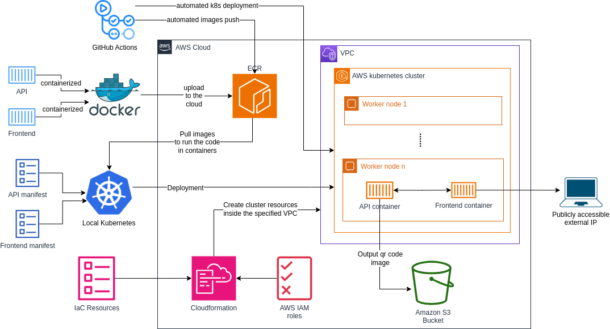

# Architecture
The solution is designed as in the diagram. The API container code uses fastapi and qrcode libraries for reading the input URL and converting it into an image and then uploading the output image to S3 bucket. The frontend container code is only for the look and colors. This diagram shows the solution design for when the cloudformation is used (not terraform).

